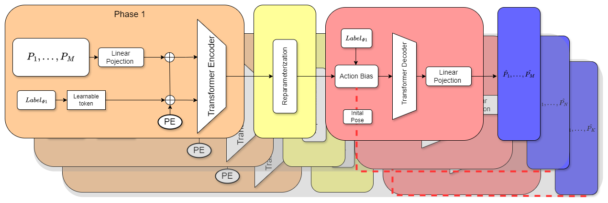

<!-- adding Teasing Image -->

## Introduction :

In this project, we take advantage of Captury MoCap system to capture a series of nuanced, artistically inspired falling movements. These movements serve as the foundation for training our machine learning model, the 'Attribute-Conditioned Variational Autoencoder'. With this model, we're able to synthesize a vast collection of falling motions that are not only realistic and diverse but also infused with artistic expression. To facilitate deeper exploration and interaction by artists, we've developed a comprehensive interactive interface. This tool enables users to observe the generated motions from multiple angles, control playback seamlessly, and apply the motions to a variety of human avatars. Our aim is to open up new possibilities in digital artistry, offering a bridge between technological innovation and the rich domain of human movement.

## Falling Attributes:

Impact Phase

- Impact Location: Heads, Torso, Arms, Legs
- Impact Attribute: Push, Prick, Shot, Contraction, Explosion

Glitch Phase

- Glitch Attribute: Shake, Flail, Flash, Stutter, Contort, Stumble, Spin
- Glitch Speed: Slow, Medium, Fast

Falling Phase:

- Falling Attribute: Release, Let go, Hinge, Surrender
- End Position: Back, Front
- End Shape: Extended, Crumpled

## attribute-conditioned variational autoencoder

## Interactive Demo

<iframe src='/PoseFallWeb/' style='width: 100%;height: 40rem;'></iframe>

## Quanlitative Result

note: the interactive demo is only for demo purpose, as it only load one set of seqeunce.
